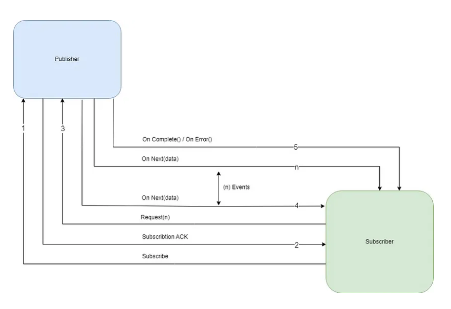

# Reactive-Programming-with-Spring-Boot

## Books API - Spring Boot Reactive
This project is a Books API built using Spring Boot Reactive Programming. It leverages the non-blocking, asynchronous nature of Spring WebFlux to handle requests efficiently, making it suitable for high-throughput environments. The API includes a search bar feature for dynamically querying books by various attributes.

## Features
Reactive endpoints for creating, updating, retrieving, and deleting books.
Asynchronous, non-blocking operations with Mono and Flux.
Integrated with R2DBC (Reactive Relational Database Connectivity) for reactive SQL database access.
Search bar functionality for filtering books based on title, author, or other attributes.
Designed for high performance with minimal blocking in large-scale environments.

###### Reactive Programming : Reactive programming is a design approach that uses asynchronous programming logic to handle real-time adjustments.

The  **Publisher** creates an event or message for every result obtained, and it can send the **Subscriber (n)** numbers of values by calling **onNext**, but the important thing to keep in mind here is that it can also signal an error by calling **onError**, which can terminate the sequence, while if **onComplete** is called, the sequence is terminated by default.

In Reactor, Flux, and Mono, there are two primary primitive publishers.

### Flux: A Flux Publisher in Reactor publishes data or event and can produce from 0 to N values asynchronously.

### Mono: There is only one value that a Mono publisher can produce, or perhaps none at all.
